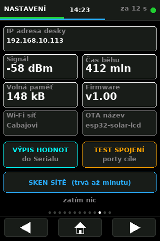
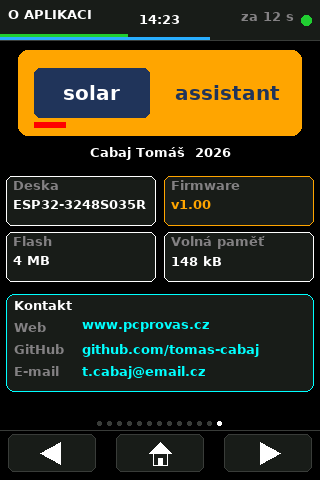

# Obrazovky a funkce · Screens and features

Přehled všech obrazovek a funkcí firmwaru **SolarAssistant-TMK v1.00**.
Overview of every screen and feature of the **SolarAssistant-TMK v1.00** firmware.

*Ostatní dokumenty · Other documents:
[README (CZ)](README.md) · [README (EN)](README.en.md) · [README (DE)](README.de.md)*

---

## Obsah · Contents

- [Obrazovky · Screens](#obrazovky--screens)
- [Funkce · Features](#funkce--features)
- [Nastavení · Settings](#nastavení--settings)
- [Použité hodnoty z API · API values used](#použité-hodnoty-z-api--api-values-used)

---

## Obrazovky · Screens

Přepínají se tlačítky dole **◀ | domů | ▶**, tečky nad nimi ukazují pozici.
Switched by the **◀ | home | ▶** buttons at the bottom; the dots above show
the position.

| # | Česky | English |
|---|---|---|
| 0 | SolarAssistant | SolarAssistant |
| 1 | BATERIE | BATTERY |
| 2 | DOBĚH BATERIE | RUNTIME |
| 3 | SOLÁR | SOLAR |
| 4 | SÍŤ A ZÁTĚŽ | GRID & LOAD |
| 5 | POČASÍ | WEATHER |
| 6 | MĚNIČ | INVERTER |
| 7 | GRAFY | CHARTS |
| 8 | HISTORIE | HISTORY |
| 9 | ÚSPORY | SAVINGS |
| 10 | NASTAVENÍ | SETTINGS |
| 11 | NASTAVENÍ 2 | SETTINGS 2 |
| 12 | O APLIKACI | ABOUT |

---

### 0 · SolarAssistant — přehled · overview

**CZ:** Úvodní obrazovka. Čtyři karty s ikonami, blok předpovědi výroby
a čtyři půlkruhové ukazatele. **Klepnutím na kterýkoli blok** se dostanete
na jeho podrobnou stránku.

**EN:** The home screen. Four icon cards, a production forecast block and
four half-circle gauges. **Tapping any block** jumps to its detail page.

| Prvek · Element | Obsah · Content |
|---|---|
| Karta Měnič · Inverter card | Teplota, využití výkonu · Temperature, power usage |
| Karta Solární PV · Solar PV card | Okamžitý výkon, napětí a proud panelů · Instant power, panel voltage and current |
| Karta Síť · Grid card | Napětí, výkon · Voltage, power |
| Karta Baterie · Battery card | Napětí, SOC, proud se znaménkem · Voltage, SOC, signed current |
| Blok Predikce · Forecast block | Vyrobeno, zbývá, dnešní úspora, posuvník průběhu · Produced, remaining, today's saving, progress bar |
| Ukazatele · Gauges | Zátěž, Solární PV, Síť, Baterie · Load, Solar PV, Grid, Battery |

---

### 1 · Baterie · Battery

**CZ:** Velký prstenec stavu nabití, rychlost změny v %/hod a směr toku.
Prstenec je zelený při nabíjení a červený při vybíjení; číslo zůstává pod
20 % červené i při nabíjení, aby varování nešlo přehlédnout.

**EN:** Large state-of-charge ring, rate of change in %/h and the flow
direction. The ring is green while charging and red while discharging; below
20 % the number stays red even while charging so the warning cannot be missed.

Napětí · Proud · Výkon · Zbývá v baterii · Nabito dnes · Vybito dnes · Minimum dnes
Voltage · Current · Power · Energy left · Charged today · Discharged today · Minimum today

---

### 2 · Doběh baterie · Battery runtime

**CZ:** Za jak dlouho bude baterie plná nebo prázdná, velkým sedmisegmentovým
písmem ve tvaru `h:mm`. Dole navíc odhad při aktuální zátěži domu, nezávisle
na tom, co zrovna dělá měnič.

**EN:** How long until the battery is full or empty, in large seven-segment
digits as `h:mm`. At the bottom an estimate at the current house load,
regardless of what the inverter is doing.

---

### 3 · Solár · Solar

**CZ:** Okamžitý výkon fotovoltaiky, průběh dne jako posuvník a špička dne.

**EN:** Instant photovoltaic power, the day's progress as a bar and today's peak.

Dnes vyrobeno · Zbývá dnes · Predikce · Osvit · Napětí panelů · Proud panelů
Produced today · Remaining today · Forecast · Irradiance · Panel voltage · Panel current

---

### 4 · Síť a zátěž · Grid and load

**CZ:** Dva ukazatele — odběr ze sítě a zátěž domu. Síťový je červený jen
při skutečném odběru, jinak šedý. Pod nimi zatížení měniče v procentech.

**EN:** Two gauges — grid import and house load. The grid one turns red only
during an actual import, otherwise it stays grey. Below them the inverter
load in percent.

Napětí sítě · Frekvence · Výstup měniče · Výstup Hz · Odebráno · Dodáno · Vlastní spotřeba · Maximum dnes
Grid voltage · Frequency · Inverter output · Output Hz · Imported · Exported · Self-consumption · Maximum today

---

### 5 · Počasí · Weather

**CZ:** Karta s ikonou podle oblačnosti, slovním popisem, teplotou a stavem
dne. Ukazatel oblačnosti a dlaždice se slunečními údaji. Východ a západ
slunce se počítají z data a zeměpisné polohy — nepotřebují síť.

**EN:** A card with an icon based on cloud cover, a description, temperature
and the day state. A cloud cover gauge and tiles with solar data. Sunrise and
sunset are calculated from the date and geographic position — no network needed.

Vítr · Osvit · Východ · Západ · Délka dne · Délka noci
Wind · Irradiance · Sunrise · Sunset · Day length · Night length

---

### 6 · Měnič · Inverter

**CZ:** Teplota měniče s barevnou škálou (zelená do 55 °C, oranžová do 70 °C,
nad tím červená) a využití výkonu.

**EN:** Inverter temperature on a colour scale (green to 55 °C, orange to
70 °C, red above) and power usage.

Max výkon · Zdánlivý výkon · Bus napětí · Max nabíjecí proud · Absorpce · Udržovací
Max power · Apparent power · Bus voltage · Max charge current · Absorption · Float

---

### 7 · Grafy · Charts

**CZ:** Tři grafy za dnešní den od půlnoci do půlnoci. Svislá čára označuje
aktuální čas, tečkované čáry jsou po šesti hodinách, vlevo je svislá stupnice
a dole časová osa.

**EN:** Three charts covering today from midnight to midnight. A vertical line
marks the current time, dotted lines every six hours, a vertical scale on the
left and a time axis at the bottom.

| Graf · Chart | Obsah · Content |
|---|---|
| FVE a zátěž · PV and load | Dvě křivky se společným měřítkem · Two curves on a shared scale |
| Výkon baterie · Battery power | Obousměrný kolem nuly · Bipolar around zero |
| Stav nabití · State of charge | 0–100 % |

> **CZ:** Do každého desetiminutového úseku se ukládá **špička**, ne průměr.
> Průměr by krátké odběry schoval — odběr 1500 W trvající dvě minuty by
> vyšel jako 300 W a v grafu by po něm nezbyla stopa.
>
> **EN:** Each ten-minute slot stores the **peak**, not the average. An
> average would hide short draws — a 1500 W load lasting two minutes would
> come out as 300 W and leave no trace in the chart.

---

### 8 · Historie · History

**CZ:** Sloupcový graf — výroba oranžově, spotřeba modře. Klepnutím na graf
se přepíná zobrazené období: **7 dní → 31 dní → 12 měsíců**. Souhrny pod
grafem se přepočítají na zvolené období.

**EN:** A bar chart — production in orange, consumption in blue. Tapping the
chart switches the period shown: **7 days → 31 days → 12 months**. The totals
below the chart are recalculated for the chosen period.

Výroba · Spotřeba · Nabito · Vybito · Ušetřeno
Production · Consumption · Charged · Discharged · Saved

> **CZ:** Denní hodnoty drží kruhový buffer na 31 dní, měsíční součty pole
> na 12 měsíců — obojí přežije restart, protože leží v NVS.
>
> **EN:** The daily values live in a 31-day ring buffer, the monthly totals in
> a 12-slot array — both survive a restart because they sit in NVS.

---

### 9 · Úspory · Savings

**CZ:** Tabulka za dnešek, aktuální měsíc a rok — výroba a spotřeba v kWh
a kolik to ušetřilo. Pod tabulkou **soběstačnost** a **porovnání
s předchozím dnem**, dole graf úspor za posledních 14 dní s popisky dnů.

**EN:** A table for today, the current month and the year — production and
consumption in kWh and how much it saved. Below the table the
**self-sufficiency** and the **comparison with the previous day**, at the
bottom a savings chart for the last 14 days with day labels.

> **CZ:** Soběstačnost = `(spotřeba − odběr ze sítě) / spotřeba`. Pruh je
> zelený nad 80 %, oranžový nad 50 %, jinak červený.
>
> **EN:** Self-sufficiency = `(consumption − grid import) / consumption`. The
> bar is green above 80 %, orange above 50 %, red otherwise.

> **CZ:** Úspora = energie, kterou dům spotřeboval, ale nemusel koupit ze
> sítě, tedy `spotřeba − odběr ze sítě`, krát cena za kWh z nastavení.
>
> **EN:** Saving = energy the house used but did not have to buy from the
> grid, that is `consumption − grid import`, times the price per kWh from
> the settings.

---

### 10 · Nastavení · Settings

**CZ:** Stav zařízení a diagnostické nástroje.

**EN:** Device status and diagnostic tools.

| Údaj · Item | |
|---|---|
| IP adresa desky · Board IP | Adresa přidělená DHCP · Address assigned by DHCP |
| Signál · Signal | Síla Wi-Fi v dBm · Wi-Fi strength in dBm |
| Čas běhu · Uptime | Minuty od startu · Minutes since boot |
| Volná paměť · Free memory | Volná halda v kB · Free heap in kB |
| Wi-Fi síť · Wi-Fi network | Název sítě · Network name |
| OTA název · OTA name | Jméno v Tools → Port · Name under Tools → Port |
| Firmware | Verze · Version |

| Tlačítko · Button | Co udělá · What it does |
|---|---|
| **VÝPIS HODNOT** · DUMP VALUES | Stáhne data a vypíše všechny topicy do Serialu · Fetches data and prints every topic to Serial |
| **TEST SPOJENÍ** · LINK TEST | Ověří bránu a zkusí obvyklé porty na adrese měniče · Checks the gateway and tries common ports on the inverter |
| **SKEN SÍTĚ** · NETWORK SCAN | Projde `.1`–`.254` a najde, kde něco poslouchá na portu 80 · Walks `.1`–`.254` looking for anything on port 80 |

---

### 11 · Nastavení 2 · Settings 2

**CZ:** Uživatelské volby. Klepnutím na řádek se hodnota posune na další,
všechno se ukládá do NVS a přežije restart i odpojení napájení.

**EN:** User options. Tapping a row advances the value; everything is stored
in NVS and survives a reboot and a power cut.

---

### 12 · O aplikaci · About

**CZ:** Logo, autor, rok, informace o desce a kontakt.

**EN:** Logo, author, year, board information and contact.

Deska · Firmware · Flash · Volná paměť · GitHub · E-mail
Board · Firmware · Flash · Free memory · GitHub · E-mail

---

## Funkce · Features

### Rozhraní · Interface

| Funkce · Feature | Popis · Description |
|---|---|
| **Čtyři jazyky** · **Four languages** | Čeština, angličtina, polština, němčina; přepíná se za běhu · Czech, English, Polish, German; switched at runtime |
| **Prokliky** · **Tap-through** | Z úvodní obrazovky přímo na podrobnou stránku · From the overview straight to the detail page |
| **Úsporný režim** · **Sleep mode** | Po nastavené době zhasne podsvícení, první dotek jen probudí · The backlight goes off after a set time; the first touch only wakes it |
| **Nastavitelný jas** · **Brightness** | Podsvícení přes PWM, 25 až 100 % · Backlight on PWM, 25 to 100 % |
| **Otočení displeje** · **Rotation** | 0° nebo 180°, s vlastní kalibrací dotyku · 0° or 180°, each with its own touch calibration |

### Data a historie · Data and history

| Funkce · Feature | Popis · Description |
|---|---|
| **Denní graf 0–24 h** · **Daily chart** | Desetiminutové špičky podle skutečného času z NTP · Ten-minute peaks bucketed by real NTP time |
| **Historie 31 dní** · **31-day history** | Denní souhrny v NVS, graf za 7 / 31 dní a 12 měsíců · Daily totals in NVS, chart for 7 / 31 days and 12 months |
| **Soběstačnost** · **Self-sufficiency** | Podíl spotřeby pokrytý vlastním zdrojem · Share of consumption covered by our own source |
| **Porovnání období** · **Period comparison** | Dnešní úspora proti včerejší v procentech · Today's saving against yesterday in percent |
| **Měsíční souhrny** · **Monthly totals** | 12 měsíců, z nich se skládá roční přehled · 12 months, summed into the yearly view |
| **Denní extrémy** · **Daily extremes** | Špička FVE, maximum zátěže, minimum SOC · PV peak, maximum load, minimum SOC |
| **Výpočet úspor** · **Savings** | Nastavitelná cena za kWh a měna (Kč, €, zł, $) · Configurable price per kWh and currency |
| **Přežije výpadek** · **Survives outage** | Nastavení, historie i souhrny jsou v NVS · Settings, history and totals live in NVS |

> **CZ:** API vrací `total/*_energy` jako počítadla od instalace, ne denní
> hodnoty — jediná skutečně denní položka je `weather/pv_energy_generated`.
> Denní spotřeba a bilance baterie se proto počítají jako rozdíl proti stavu
> počítadel o půlnoci.
>
> **EN:** The API returns `total/*_energy` as counters since installation,
> not daily figures — the only truly daily item is
> `weather/pv_energy_generated`. Daily consumption and the battery balance
> are therefore computed as the difference against the counter state at
> midnight.

### Signalizace · Signalling

| Funkce · Feature | Popis · Description |
|---|---|
| **RGB dioda podle zátěže** · **Load LED** | Zelená · oranžová · červená podle nastavených prahů · Green · orange · red by configurable thresholds |
| **Blikání při velké zátěži** · **Blink on heavy load** | Volitelný práh, ve výchozím stavu vypnuto · Optional threshold, off by default |
| **Upozornění** · **Alerts** | SOC pod prahem nebo přehřátý měnič — červený rámeček, červená hlavička, blikající dioda · SOC below the threshold or an overheating inverter — red frame, red header, blinking LED |
| **Detekce starých dat** · **Stale data** | Po 75 s bez načtení zčervená hlavička a ukáže stáří dat · After 75 s without a fetch the header turns red and shows the data age |

### Síť a údržba · Network and maintenance

| Funkce · Feature | Popis · Description |
|---|---|
| **OTA** | Aktualizace firmwaru přes Wi-Fi, s ukazatelem průběhu na displeji · Firmware update over Wi-Fi with on-screen progress |
| **NTP** | Čas z internetu včetně letního času · Internet time including daylight saving |
| **Automatický restart** · **Auto reboot** | Po 30 neúspěšných načteních, historie se předtím uloží · After 30 failed fetches, the history is saved first |
| **Diagnostika sítě** · **Network diagnostics** | Test brány, sken portů i celé podsítě přímo v zařízení · Gateway test, port scan and full subnet scan on the device |
| **Východ a západ slunce** · **Sunrise and sunset** | Počítá se z data a polohy, bez sítě · Calculated from date and position, no network |

---

## Nastavení · Settings

| Položka · Item | Možnosti · Options | Výchozí · Default |
|---|---|---|
| Jazyk · Language | Čeština / English / Polski / Deutsch | Čeština |
| Obnova · Refresh | 10 / 20 / 30 / 60 s | 20 s |
| Zhasnout · Sleep | vypnuto / 1 / 5 / 15 / 30 min | 5 min |
| Jas · Brightness | 25 / 50 / 75 / 100 % | 100 % |
| Rozsah ukazatelů · Gauge range | 1 / 2 / 3 / 5 kW | 2 kW |
| Otočení · Rotation | 0° / 180° | 0° |
| LED zelená do · LED green to | 400 / 600 / 800 / 1000 W | 800 W |
| LED oranžová do · LED orange to | 1500 / 2000 / 2500 / 3000 W | 2000 W |
| LED bliká nad · LED blinks above | vypnuto / 1,5 / 2 / 2,5 / 3 / 4 kW | vypnuto |
| Cena kWh · Price per kWh | 0,10 až 15,00 | 6,00 |
| Měna · Currency | Kč / € / zł / $ | Kč |

---

## Použité hodnoty z API · API values used

Solar Assistant vrací přes 100 topiců, firmware jich používá 40. Mapování je
v tabulce `METRICS[]`, přidání nebo odebrání je jeden řádek.

Solar Assistant returns over 100 topics, the firmware uses 40. The mapping
lives in the `METRICS[]` table; adding or removing one is a single line.

### Okamžité hodnoty · Instant values

`total/pv_power` · `total/load_power` · `total/grid_power` ·
`total/battery_power` · `total/battery_state_of_charge` ·
`total/battery_voltage` · `total/battery_current` · `total/battery_capacity` ·
`total/grid_voltage` · `total/grid_frequency` · `total/ac_output_voltage` ·
`total/ac_output_frequency` · `total/load_percentage` · `total/system_power` ·
`total/bus_voltage`

### Počítadla energie · Energy counters

`total/load_energy` · `total/grid_energy_in` · `total/grid_energy_out` ·
`total/battery_energy_in` · `total/battery_energy_out` · `total/pv_energy`

### Počasí a predikce · Weather and forecast

`weather/cloud_cover` · `weather/global_tilted_irradiance` ·
`weather/is_day` · `weather/outside_temperature` ·
`weather/pv_energy_generated` · `weather/pv_energy_progress` ·
`weather/pv_energy_remaining_today` · `weather/pv_power_predicted` ·
`weather/pv_temperature_predicted` · `weather/weather_code` ·
`weather/wind_speed`

### Měnič · Inverter

`inverter_1/temperature` · `inverter_1/max_ac_output_apparent_power` ·
`inverter_1/pv_voltage` · `inverter_1/pv_current` ·
`inverter_1/load_apparent_power` · `inverter_1/battery_float_charge_voltage` ·
`inverter_1/battery_absorption_charge_voltage` · `inverter_1/max_charge_current`

### Rozhodnutí, která nejsou z kódu zřejmá · Non-obvious choices

| Údaj · Value | Zdroj · Source | Proč · Why |
|---|---|---|
| Dnes vyrobeno · Produced today | `weather/pv_energy_generated` | `total/pv_energy` je počítadlo od instalace · is a counter since installation |
| Max výkon měniče · Inverter max power | `inverter_1/max_ac_output_apparent_power` | Zdánlivý výkon ve VA · Apparent power in VA |
| Znaménko baterie · Battery sign | kladné = nabíjení · positive = charging | |
| Znaménko sítě · Grid sign | kladné = odběr · positive = import | |
