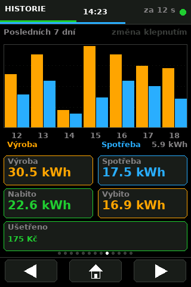
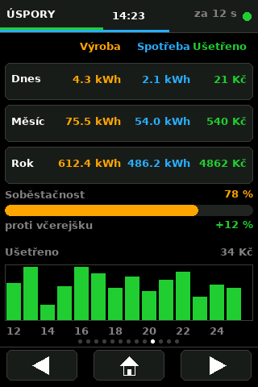
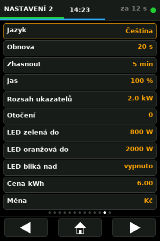

# SolarAssistant-TMK

Grafischer Wandmonitor für Photovoltaikanlagen auf Basis des
**ESP32-3248S035R** (3,5" Touchdisplay). Er liest die Daten von
[Solar Assistant](https://solar-assistant.io/) über dessen REST-API und stellt
sie auf neun Hochformat-Bildschirmen dar.

Firmware **v1.00** · Autor: Cabaj Tomáš · 2026

*Weitere Sprachen: [Čeština](README.md) · [English](README.en.md)*
*Ausführliche Liste der Bildschirme und Funktionen: [FEATURES.md](FEATURES.md)*

---

## Bildschirmfotos

> 1:1 gerendert (320×480) mit Beispieldaten. Das echte Display sieht genauso aus.

| Übersicht | Batterie | Diagramme |
|---|---|---|
|  |  |  |

| Laufzeit | Solar | Wetter |
|---|---|---|
|  |  |  |

| Verlauf | Ersparnis | Einstellungen |
|---|---|---|
|  |  |  |

**[Alle 13 Bildschirme auf einem Blatt](images/vsechny-obrazovky.png)**

---

## Inhalt

- [Funktionen](#funktionen)
- [Hardware](#hardware)
- [Pinbelegung](#pinbelegung)
- [Bibliotheken](#bibliotheken)
- [Arduino-IDE-Einstellungen](#arduino-ide-einstellungen)
- [TFT_eSPI-Konfiguration](#tft_espi-konfiguration)
- [Firmware-Konfiguration](#firmware-konfiguration)
- [Bildschirme](#bildschirme)
- [Einstellungen zur Laufzeit](#einstellungen-zur-laufzeit)
- [Sprachen und Schrift](#sprachen-und-schrift)
- [OTA](#ota)
- [Projektstruktur](#projektstruktur)
- [Fehlerbehebung](#fehlerbehebung)

---

## Funktionen

- **9 Bildschirme** – Übersicht, Batterie, Solar, Netz und Last, Wetter,
  Wechselrichter, Tagesdiagramme und zwei Einstellungsseiten
- **Tagesdiagramm 0–24 h** – Spitzenwert jedes Zehn-Minuten-Abschnitts nach
  echter NTP-Zeit; ein Mittelwert würde kurze Lasten verstecken
- **Lastsignalisierung über die RGB-LED** auf der Platine – grün / orange / rot
- **4 Oberflächensprachen** – Tschechisch, Englisch, Polnisch, Deutsch
- **Erkennung veralteter Daten** – bei Verbindungsverlust täuscht das Display
  keinen normalen Betrieb vor
- **Energiesparmodus** – Hintergrundbeleuchtung schaltet sich nach Inaktivität
  ab, Berührung weckt sie
- **OTA** – Firmware-Update über WLAN, ohne Kabel
- **Netzwerkdiagnose direkt im Gerät** – Porttest und Scan des ganzen Subnetzes
- **Verlauf übersteht einen Neustart** – wird im NVS gespeichert
- **Verlaufsdiagramm über 7 Tage, 31 Tage oder 12 Monate** – Antippen des
  Diagramms schaltet um
- **Autarkie** – welchen Anteil des Verbrauchs die eigene Quelle deckte
- **Vergleich mit dem Vortag** – um wie viel Prozent heute mehr oder
  weniger gespart wurde
- **Tageswerte** – PV-Spitze, minimaler SOC, maximale Last
- **Warnungen** – schwache Batterie oder überhitzter Wechselrichter
- **Automatischer Neustart** nach längerem Verbindungsverlust

---

## Hardware

### Platine

**ESP32-3248S035R**, teilweise als „Cheap Yellow Display 3.5" oder
„ESP32 Yellow" verkauft.

| | |
|---|---|
| MCU | ESP32-D0WD-V3, zwei Kerne, 240 MHz |
| Flash | 4 MB |
| PSRAM | keines |
| Display | 3,5", Controller **ST7796**, 480×320 px, SPI |
| Touch | **XPT2046**, resistiv, **teilt sich den SPI-Bus mit dem Display** |
| Hintergrundbeleuchtung | GPIO27, PWM-gesteuert |
| RGB-LED | GPIO 4 / 16 / 17, aktiv LOW |
| Versorgung | USB-C oder Micro-USB, 5 V |

> **Verwechslungsgefahr.** Die meisten Anleitungen im Netz beschreiben die
> 2,8"-Variante **ESP32-2432S028R** mit anderem Controller (ILI9341),
> Beleuchtung an GPIO21 und Touch an einem eigenen SPI-Bus. Für diese Platine
> **passen sie nicht**.

### Woran Sie die richtige Platine erkennen

| Merkmal | 2,8" (2432S028R) | **diese Platine (3248S035R)** |
|---|---|---|
| Diagonale | 2,8" | **3,5"** |
| Controller | ILI9341 | **ST7796** |
| Auflösung | 320×240 | **480×320** |
| Beleuchtung | GPIO21 | **GPIO27** |
| Touch | eigener SPI (25/32/33/39) | **gemeinsamer SPI, CS 33** |

---

## Pinbelegung

### Display (HSPI)

| Funktion | GPIO |
|---|---|
| MISO | 12 |
| MOSI | 13 |
| SCLK | 14 |
| CS | 15 |
| DC | 2 |
| RST | – (fest an EN) |
| Beleuchtung | **27** |

### Touch XPT2046

Teilt sich den SPI-Bus mit dem Display, nur Chip Select ist eigen.

| Funktion | GPIO |
|---|---|
| CS | **33** |
| IRQ | 36 (von der Firmware nicht genutzt) |

### Weitere Peripherie

| Peripherie | GPIO |
|---|---|
| RGB-LED – R / G / B | 4 / 16 / 17 (aktiv LOW) |
| SD-Karte – CS / MOSI / MISO / SCK | 5 / 23 / 19 / 18 |
| Lautsprecher | 26 |

### GPIO-Einschränkungen des ESP32

- GPIO **34, 35, 36, 39** sind reine Eingänge, ohne Pull-up/Pull-down
- GPIO **12** ist ein Strapping-Pin (MTDI) und darf beim Booten nicht HIGH sein
- ADC2 (GPIO 4, 12–15, 25–27) **ist bei aktivem WLAN nicht lesbar** – für
  Analogeingänge ADC1 (GPIO 32–39) verwenden

---

## Bibliotheken

Installation über **Tools → Manage Libraries**:

| Bibliothek | Autor | Version |
|---|---|---|
| **TFT_eSPI** | Bodmer | 2.5.x oder neuer |
| **ArduinoJson** | Benoit Blanchon | 6.x oder 7.x |

Alles Übrige (`WiFi`, `HTTPClient`, `ArduinoOTA`, `Preferences`, `time.h`)
gehört zum ESP32-Core und muss nicht installiert werden.

Der Sketch gleicht Versionsunterschiede selbst aus:

- **ArduinoJson 6 vs. 7** – in v7 wurde `DynamicJsonDocument` entfernt,
  Umschaltung über `ARDUINOJSON_VERSION_MAJOR`
- **ESP32-Core 2.x vs. 3.x** – v3 hat die LEDC-API geändert (`ledcSetup` +
  `ledcAttachPin` → `ledcAttach`), geregelt über `ESP_ARDUINO_VERSION_MAJOR`

---

## Arduino-IDE-Einstellungen

### ESP32-Unterstützung

*File → Preferences → Additional boards manager URLs*:

```
https://espressif.github.io/arduino-esp32/package_esp32_index.json
```

Danach *Tools → Board → Boards Manager* → **esp32** (Espressif Systems)
installieren, Version 2.0.x oder 3.x.

### Menü Tools

| Eintrag | Wert |
|---|---|
| Board | **ESP32 Dev Module** |
| Upload Speed | 921600 |
| Flash Size | 4MB (32Mb) |
| **Partition Scheme** | **Huge APP (3MB No OTA/1MB SPIFFS)** |
| PSRAM | Disabled |

> **Partition Scheme muss Huge APP sein.** WLAN, HTTPClient, ArduinoJson,
> TFT_eSPI, die eingebettete Schrift und OTA passen zusammen nicht in die
> Standardaufteilung; der Build scheitert mit
> `text section exceeds available space`.

---

## TFT_eSPI-Konfiguration

TFT_eSPI wird **durch Bearbeiten einer Datei innerhalb der Bibliothek**
konfiguriert, nicht im Sketch. Den Inhalt von `User_Setup_CYD.h` aus diesem
Projekt kopieren nach:

```
<sketchbook>\libraries\TFT_eSPI\User_Setup.h
```

Den Sketchbook-Pfad finden Sie unter *File → Preferences → Sketchbook location*.

Erforderliches Minimum:

```c
#define ST7796_DRIVER
#define TFT_WIDTH  320
#define TFT_HEIGHT 480
#define USE_HSPI_PORT     // ohne dies läuft das Display auf VSPI und zeichnet nichts
#define TFT_MISO 12
#define TFT_MOSI 13
#define TFT_SCLK 14
#define TFT_CS   15
#define TFT_DC    2
#define TFT_RST  -1
#define TFT_BL   27
#define TFT_BACKLIGHT_ON HIGH
#define TOUCH_CS 33       // Touch teilt sich den Bus mit dem Display
```

> **Jedes Bibliotheks-Update überschreibt `User_Setup.h`**, das Kopieren muss
> also wiederholt werden. Der Sketch enthält deshalb eine Prüfung zur
> Compilezeit – bei veralteter Datei bricht der Build mit einer Erklärung ab,
> statt Ihnen einen schwarzen Bildschirm zu hinterlassen.

Die Arduino IDE cached zudem kompilierte Bibliotheken. Nach Änderung von
`User_Setup.h` die IDE schließen und neu öffnen.

---

## Firmware-Konfiguration

Vor dem ersten Build `secrets.example.h` nach `secrets.h` kopieren und die
eigenen Werte eintragen. `secrets.h` steht in `.gitignore` und darf nicht
veröffentlicht werden.

```c
// secrets.h — WLAN
const char* ssid     = "Ihre_SSID";
const char* password = "Ihr_Passwort";

// Solar Assistant
#define API_HOST "192.168.10.240"
const char* url  = "http://" API_HOST "/api/v1/metrics";
const char* user = "admin";
const char* pass = "Ihr_Passwort";

// OTA
#define OTA_HOST     "esp32-solar-lcd"
#define OTA_PASSWORD "Ihr_Passwort"

// Zeitzone (inklusive Sommerzeit)
#define NTP_TZ "CET-1CEST,M3.5.0,M10.5.0/3"
```

### Verwendete API-Werte

Solar Assistant liefert über 100 Topics, die Firmware nutzt davon 40. Die
Zuordnung steht in der Tabelle `METRICS[]` – Hinzufügen oder Entfernen ist eine
einzige Zeile.

Einige Entscheidungen, die aus dem Code nicht ersichtlich sind:

| Wert | Quelle | Warum |
|---|---|---|
| Heute erzeugt | `weather/pv_energy_generated` | `total/pv_energy` erfasst einen längeren Zeitraum |
| Heute verbleibend | `weather/pv_energy_remaining_today` | |
| Max. WR-Leistung | `inverter_1/max_ac_output_apparent_power` | Scheinleistung in VA |

**Vorzeichen:** positive `battery_power` = Laden, positive `grid_power` =
Netzbezug.

Eine vollständige Liste aller verfügbaren Topics liefert die Schaltfläche
**WERTE AUSGEBEN** auf der Seite EINSTELLUNGEN – die Ausgabe erfolgt im
Serial Monitor (115200 Baud) samt Einheiten.

---

## Bildschirme

Umschaltung über die Tasten unten: **◀ | Start | ▶**. Die Punkte darüber zeigen
die Position.

| # | Bildschirm | Inhalt |
|---|---|---|
| 0 | **Solar Assistant** | 4 Karten mit Symbolen, Prognoseblock mit Fortschrittsbalken, 4 Anzeigen |
| 1 | **Batterie** | Großer SOC-Ring, %/Stunde, Spannung, Strom, Leistung, Kapazität |
| 2 | **Solar** | PV-Leistung, Tagesverlauf, Prognose, Einstrahlung, Panelspannung und -strom |
| 3 | **Netz & Last** | Bezug, Last, WR-Auslastung, Spannung, Frequenz, Energie |
| 4 | **Wetter** | Bewölkung, Temperatur, Wind, Einstrahlung, Ertragsprognose |
| 5 | **Wechselrichter** | Temperatur, Auslastung, Ladespannungen, Bus-Spannung |
| 6 | **Diagramme** | Heute 0–24 h: PV und Last, Batterieleistung, SOC |
| 7 | **Einstellungen** | IP, Signal, Laufzeit, Speicher, Version + Diagnosewerkzeuge |
| 8 | **Einstellungen 2** | Sprache und alle Benutzereinstellungen |

Auf dem Startbildschirm lässt sich **jeder Block antippen** und führt zur
zugehörigen Detailseite.

### Farben der Anzeigen

| Anzeige | Farbe |
|---|---|
| Last | Blau |
| Solar PV | Orange |
| Netz | Rot bei Bezug, sonst grau |
| Batterie | Grün beim Laden, rot beim Entladen |

Auf der Batterieseite bleibt die Zahl **unter 20 % auch beim Laden rot** – die
Warnung hat Vorrang vor der Information über die Flussrichtung.

### Lastsignalisierung per RGB-LED

| Farbe | Last |
|---|---|
| Grün | unter der Schwelle „LED grün bis" |
| Orange | zwischen den Schwellen |
| Rot | über der Schwelle „LED orange bis" |
| Blau | keine Verbindung zur API |

### Erkennung veralteter Daten

Wenn länger als 75 s nichts abgerufen werden konnte:

- die Kopfzeile wird rot
- statt des Countdowns erscheint das Alter der Daten
- um den Inhalt liegt ein roter Rahmen
- die LED auf der Platine wird blau

---

## Einstellungen zur Laufzeit

Seite **EINSTELLUNGEN 2**; Antippen einer Zeile schaltet den Wert weiter. Alles
wird im NVS gespeichert und übersteht Neustart und Firmware-Update.

| Eintrag | Optionen | Standard |
|---|---|---|
| Sprache | Čeština / English / Polski / Deutsch | Tschechisch |
| Aktualisierung | 10 / 20 / 30 / 60 s | 20 s |
| Abschalten | aus / 1 / 5 / 15 / 30 Min | 5 Min |
| Helligkeit | 25 / 50 / 75 / 100 % | 100 % |
| Anzeigebereich | 1 / 2 / 3 / 5 kW | 2 kW |
| LED grün bis | 400 / 600 / 800 / 1000 W | 800 W |
| LED orange bis | 1500 / 2000 / 2500 / 3000 W | 2000 W |
| Drehung | 0° / 180° | 0° |

> Die Touch-Kalibrierung gilt immer nur für eine Drehung. Nach dem Ändern der
> Drehung startet deshalb eine neue Kalibrierung, die unter eigenem Schlüssel
> gespeichert wird.

### Diagnosewerkzeuge (Seite EINSTELLUNGEN)

| Schaltfläche | Funktion |
|---|---|
| **WERTE AUSGEBEN** | Holt Daten und gibt alle Topics seriell aus |
| **VERBINDUNGSTEST** | Prüft das Gateway und übliche Ports am Wechselrichter |
| **NETZ-SCAN** | Durchläuft `.1`–`.254` und sucht alles auf Port 80 |

---

## Sprachen und Schrift

Die eingebauten TFT_eSPI-Schriften enthalten nur ASCII. Das Projekt bettet
deshalb eine eigene **Smooth-Schrift** (Format `.vlw`) als Byte-Array ein –
DejaVu Sans Bold 14 px, 136 Glyphen für Tschechisch, Polnisch und Deutsch.

Texte laufen über diese Schrift, **Zahlen bleiben auf den eingebauten
Schriften** – Ziffern brauchen keine diakritischen Zeichen, und die
Sieben-Segment-Schrift wirkt bei großen Werten besser.

TFT_eSPI kann **nur eine Smooth-Schrift gleichzeitig** geladen haben, daher
gibt es im Code zwei Hüllen, die das Umschalten selbst übernehmen:

| Funktion | Verwendung |
|---|---|
| `tCz(text, x, y)` | Text mit Sonderzeichen, Smooth-Schrift |
| `tAs(text, x, y, font)` | Zahlen und Einheiten, eingebaute Schrift |

### Schrift und Übersetzungen neu erzeugen

```bash
pip install pillow
python mklang.py          # erzeugt Lang.h und glyphs.txt aus der Übersetzungstabelle
python make_vlw.py 14 FontUi FontUi.h glyphs.txt
```

Die Größe 14 px ist so gewählt, dass die Zeilenhöhe (17 px) der eingebauten
Schrift 2 entspricht und die Layouts unverändert bleiben.

> **Schriftlizenz.** DejaVu Sans steht unter einer freien Lizenz (Bitstream
> Vera / DejaVu), die Nutzung, Änderung und Weitergabe erlaubt. Die Quell-TTF
> gehört zum Projekt, vollständiger Text in `LICENSE_DEJAVU.txt`.

---

## OTA

Nach dem Verbinden meldet sich die Platine als Netzwerkport. In der Arduino IDE
erscheint sie unter **Tools → Port** als `esp32-solar-lcd` und lässt sich ganz
normal per Upload flashen, ohne Kabel. Der Fortschritt wird in Prozent auf dem
Display angezeigt.

**Der erste Upload muss über USB erfolgen.**

Das Passwort wird in `OTA_PASSWORD` gesetzt. Ein leeres Passwort bedeutet, dass
jeder im selben Netz die Firmware überschreiben kann.

---

## Projektstruktur

```
SolaAssistant-TMK/
├── SolaAssistant-TMK.ino   Hauptsketch
├── FontUi.h                Smooth-Schrift als Byte-Array (generiert)
├── Lang.h                  Übersetzungstabelle (generiert)
├── User_Setup_CYD.h        TFT_eSPI-Konfiguration – wird in die Bibliothek kopiert
├── DejaVuSans-Bold.ttf     Quellschrift für den Generator
├── make_vlw.py             Schriftgenerator
├── render.py               Renderer der Bildschirmfotos
├── screens.py              Definitionen mit Beispieldaten
├── images/                 gerenderte Bildschirmfotos (generiert)
├── mklang.py               Übersetzungsgenerator
├── glyphs.txt              Zeichensatz für die Schrift (generiert)
├── check_fit.py            prüft, ob die Beschriftungen in alle Sprachen passen
├── check_glyphs.py         prüft, ob jedes Zeichen eine Glyphe hat
├── check_braces.py         prüft die Struktur des Sketches
├── FEATURES.md             Liste der Bildschirme und Funktionen (CZ/EN)
├── LICENSE                 MIT
├── LICENSE_DEJAVU.txt      Lizenz der mitgelieferten Schrift
├── README.md               tschechische Fassung
├── README.en.md            englische Fassung
└── README.de.md            diese Datei
```

`FontUi.h`, `Lang.h` und `glyphs.txt` müssen im selben Ordner wie der Sketch
liegen.

---

## Lizenz

Der Code steht unter **MIT** (siehe `LICENSE`). Die mitgelieferte Schrift
DejaVu Sans hat eine eigene freie Lizenz, siehe `LICENSE_DEJAVU.txt`.

---

## Fehlerbehebung

| Symptom | Ursache / Abhilfe |
|---|---|
| Build bricht bei `#error` ab | Veraltete `User_Setup.h` in der Bibliothek – erneut kopieren |
| `text section exceeds available space` | Partition Scheme → Huge APP (3MB) |
| Weißer Bildschirm, Beleuchtung an | Falscher Treiber – `ST7796_DRIVER` prüfen |
| Bildschirm bleibt dunkel | `TFT_BL` muss 27 sein |
| Es wird gar nichts gezeichnet | `USE_HSPI_PORT` fehlt – Display liefe auf VSPI |
| Bild steht auf dem Kopf | Einstellungen 2 → Drehung, oder `iRot` |
| Rot und Blau vertauscht | `TFT_RGB_ORDER` zwischen `TFT_BGR` und `TFT_RGB` umschalten |
| Touch reagiert nicht | `#define TOUCH_CS 33` fehlt |
| Touch ist versetzt | Beim Einschalten Finger auf dem Display halten → Kalibrierung |
| `HTTP-Fehler: -1` | TCP-Verbindung fehlgeschlagen – VERBINDUNGSTEST und NETZ-SCAN nutzen |
| `HTTP-Fehler: 401` | Falscher API-Benutzername oder falsches Passwort |
| `JSON-Fehler: NoMemory` | `DynamicJsonDocument(24576)` vergrößern (nur ArduinoJson 6) |
| Diagramm leer, wartet auf Zeit | Kein NTP-Zugang – Gateway und DNS prüfen |
| Änderung in `User_Setup.h` wirkt nicht | IDE-Cache – Arduino IDE schließen und neu öffnen |
| Verstümmelte Sonderzeichen | Der Sketch muss als UTF-8 gespeichert sein |

### Wenn keine Daten mehr ankommen

1. **VERBINDUNGSTEST** – antwortet nicht einmal das Gateway, hängt die Platine
   in einem Netz mit Client-Isolation (Gast-WLAN oder anderes VLAN) und
   erreicht das LAN überhaupt nicht
2. **NETZ-SCAN** – findet, was wo lauscht; Solar Assistant kann per DHCP eine
   andere IP bekommen haben
3. Vom Rechner aus prüfen:
   ```bash
   curl -v -u admin:passwort http://192.168.10.240/api/v1/metrics
   ```

Eine **feste DHCP-Reservierung** für den Wechselrichter im Router ist
empfehlenswert, damit sich das nicht wiederholt.
