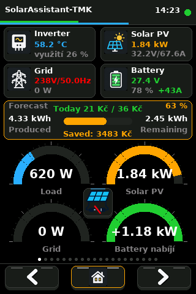
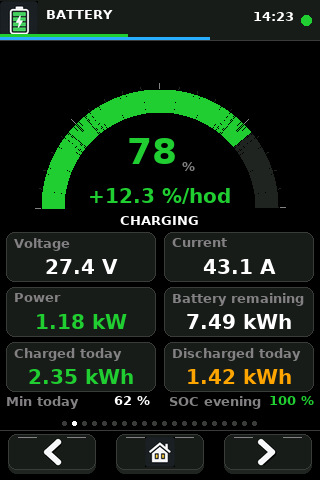
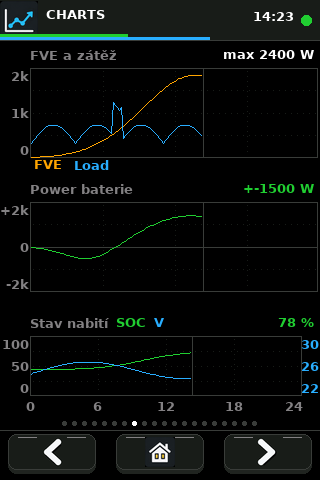
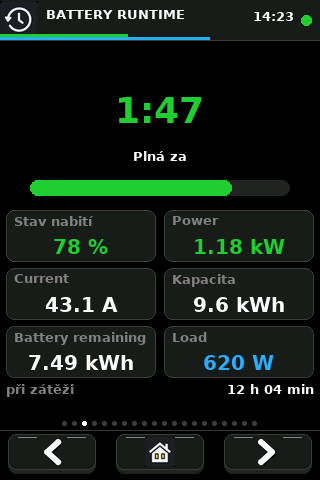
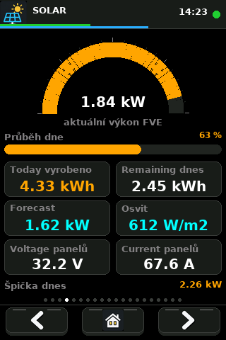
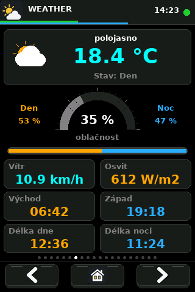
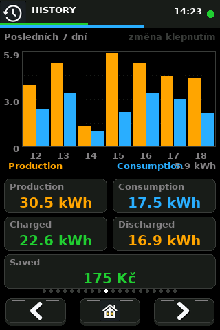
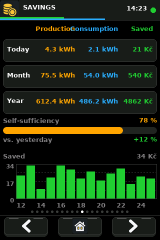
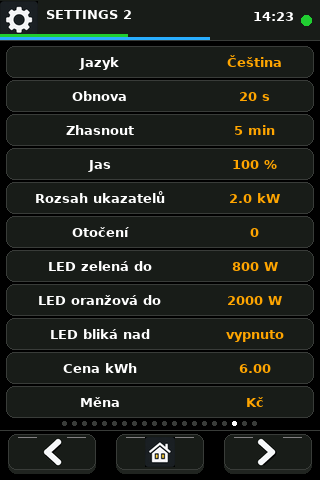

# SolarAssistant-TMK

A graphical wall monitor for photovoltaic systems, running on the
**ESP32-3248S035R** (3.5" touch display). It reads data from
[Solar Assistant](https://solar-assistant.io/) through its REST API and shows
it across twenty portrait screens.

Firmware **v2.03** · Author: Cabaj Tomáš · 2026

*Other languages: [Čeština](README.md) · [Deutsch](README.de.md)*
*Detailed list of screens and features: [FEATURES.md](FEATURES.md)*

---

## Screenshots

> Rendered 1:1 (320×480) with sample data. The real display looks the same.

| Overview | Battery | Charts |
|---|---|---|
|  |  |  |

| Runtime | Solar | Weather |
|---|---|---|
|  |  |  |

| History | Savings | Settings |
|---|---|---|
|  |  |  |

**[All 20 screens on one sheet](images-en/vsechny-obrazovky.png)**

---

## Contents

- [Features](#features)
- [Hardware](#hardware)
- [Board pinout](#board-pinout)
- [Libraries](#libraries)
- [Arduino IDE settings](#arduino-ide-settings)
- [TFT_eSPI configuration](#tft_espi-configuration)
- [Firmware configuration](#firmware-configuration)
- [Screens](#screens)
- [Runtime settings](#runtime-settings)
- [Languages and font](#languages-and-font)
- [OTA](#ota)
- [Project structure](#project-structure)
- [Troubleshooting](#troubleshooting)

---

## Features

- **20 screens** – overview, battery, battery life, solar, grid and load, weather, inverter,
  power and temperature charts, history, savings, forecast, settings and errors
- **Daily 0–24 h chart** – the peak of every ten-minute slot, bucketed by real
  NTP time; an average would hide short draws
- **Load signalling via the on-board RGB LED** – green / orange / red
- **4 interface languages** – Czech, English, Polish, German
- **Stale data detection** – when the link drops, the display says so instead
  of quietly showing old values
- **Sleep mode** – backlight turns off after inactivity, touch wakes it
- **OTA** – firmware updates over Wi-Fi, no cable
- **Network diagnostics on the device** – gateway and common API port tests
- **History survives a reboot** – stored in NVS and picked up again
- **History chart over 7 days, 31 days or 12 months** – tap the chart to
  switch
- **Self-sufficiency** – what share of the consumption our own source covered
- **Comparison with the previous day** – by how many percent today saved
  more or less
- **Daily extremes** – PV peak, minimum SOC, maximum load
- **Alerts** – low battery or inverter overheating
- **Automatic reboot** after a prolonged connection loss

---

## Hardware

### Board

**ESP32-3248S035R**, sometimes sold as "Cheap Yellow Display 3.5" or
"ESP32 Yellow".

| | |
|---|---|
| MCU | ESP32-D0WD-V3, dual core, 240 MHz |
| Flash | 4 MB |
| PSRAM | none |
| Display | 3.5", **ST7796** controller, 480×320 px, SPI |
| Touch | **XPT2046**, resistive, **shares the SPI bus with the display** |
| Backlight | GPIO27, PWM controlled |
| RGB LED | GPIO 4 / 16 / 17, active LOW |
| Power | USB-C or micro-USB, 5 V |

> **Do not confuse the variants.** Most tutorials online describe the 2.8"
> **ESP32-2432S028R**, which uses a different controller (ILI9341), backlight
> on GPIO21 and touch on its own SPI bus. Those guides **do not apply** to this
> board.

### How to tell you have the right board

| Property | 2.8" (2432S028R) | **this board (3248S035R)** |
|---|---|---|
| Diagonal | 2.8" | **3.5"** |
| Controller | ILI9341 | **ST7796** |
| Resolution | 320×240 | **480×320** |
| Backlight | GPIO21 | **GPIO27** |
| Touch | own SPI (25/32/33/39) | **shared SPI, CS 33** |

---

## Board pinout

### Display (HSPI)

| Function | GPIO |
|---|---|
| MISO | 12 |
| MOSI | 13 |
| SCLK | 14 |
| CS | 15 |
| DC | 2 |
| RST | – (tied to EN) |
| Backlight | **27** |

### XPT2046 touch

Shares the display SPI bus; only the chip select is its own.

| Function | GPIO |
|---|---|
| CS | **33** |
| IRQ | 36 (unused by the firmware) |

### Other peripherals

| Peripheral | GPIO |
|---|---|
| RGB LED – R / G / B | 4 / 16 / 17 (active LOW) |
| SD card – CS / MOSI / MISO / SCK | 5 / 23 / 19 / 18 |
| Speaker | 26 |

### ESP32 GPIO constraints

- GPIO **34, 35, 36, 39** are input only, no pull-up/pull-down
- GPIO **12** is a strapping pin (MTDI) and must not be pulled HIGH at boot
- ADC2 (GPIO 4, 12–15, 25–27) **cannot be read while Wi-Fi is on** – use ADC1
  (GPIO 32–39) for analog inputs

---

## Libraries

Install through **Tools → Manage Libraries**:

| Library | Author | Version |
|---|---|---|
| **TFT_eSPI** | Bodmer | 2.5.x or newer |
| **ArduinoJson** | Benoit Blanchon | 6.x or 7.x |

Everything else (`WiFi`, `HTTPClient`, `ArduinoOTA`, `Preferences`, `time.h`)
ships with the ESP32 core — nothing to install.

The sketch handles version differences on its own:

- **ArduinoJson 6 vs 7** – v7 removed `DynamicJsonDocument`, switched via
  `ARDUINOJSON_VERSION_MAJOR`
- **ESP32 core 2.x vs 3.x** – v3 changed the LEDC API (`ledcSetup` +
  `ledcAttachPin` → `ledcAttach`), handled by `ESP_ARDUINO_VERSION_MAJOR`

---

## Arduino IDE settings

### ESP32 support

*File → Preferences → Additional boards manager URLs*:

```
https://espressif.github.io/arduino-esp32/package_esp32_index.json
```

Then *Tools → Board → Boards Manager* → install **esp32** (Espressif Systems),
version 2.0.x or 3.x.

### Tools menu

| Item | Value |
|---|---|
| Board | **ESP32 Dev Module** |
| Upload Speed | 921600 |
| Flash Size | 4MB (32Mb) |
| **Partition Scheme** | **Minimal SPIFFS (1.9MB APP with OTA/190KB SPIFFS)** |
| PSRAM | Disabled |

> OTA requires **Minimal SPIFFS** with two 1.9MB application slots.

---

## TFT_eSPI configuration

TFT_eSPI is configured by **editing a file inside the library**, not in the
sketch. Copy the contents of `User_Setup_CYD.h` from this project over:

```
<sketchbook>\libraries\TFT_eSPI\User_Setup.h
```

The sketchbook path is in *File → Preferences → Sketchbook location*.

Minimum required:

```c
#define ST7796_DRIVER
#define TFT_WIDTH  320
#define TFT_HEIGHT 480
#define USE_HSPI_PORT     // without it the display runs on VSPI and draws nothing
#define TFT_MISO 12
#define TFT_MOSI 13
#define TFT_SCLK 14
#define TFT_CS   15
#define TFT_DC    2
#define TFT_RST  -1
#define TFT_BL   27
#define TFT_BACKLIGHT_ON HIGH
#define TOUCH_CS 33       // touch shares the display bus
```

> **Every library update overwrites `User_Setup.h`**, so the copy has to be
> repeated. The sketch therefore contains a compile-time guard — with a stale
> file in the library the build fails with an explanation instead of leaving
> you with a black screen.

Arduino IDE also caches compiled libraries. After changing `User_Setup.h`,
close and reopen the IDE.

---

## Firmware configuration

Before the first build, copy `secrets.example.h` to `secrets.h` and fill in
your values. `secrets.h` is in `.gitignore` and must not be published.

```c
// secrets.h — Wi-Fi
const char* ssid     = "your_ssid";
const char* password = "your_password";

// Solar Assistant
#define API_HOST "192.168.10.240"
const char* url  = "http://" API_HOST "/api/v1/metrics";
const char* user = "admin";
const char* pass = "your_password";

// OTA
#define OTA_HOST     "esp32-solar-lcd"
#define OTA_PASSWORD "your_password"

// Time zone (including DST)
#define NTP_TZ "CET-1CEST,M3.5.0,M10.5.0/3"
```

### API values in use

Solar Assistant returns over 100 topics; the firmware uses 40 of them. The
mapping lives in the `METRICS[]` table — adding or removing one is a single
line.

A few choices that are not obvious from the code:

| Value | Source | Why |
|---|---|---|
| Produced today | `weather/pv_energy_generated` | `total/pv_energy` covers a longer period |
| Remaining today | `weather/pv_energy_remaining_today` | |
| Inverter max power | `inverter_1/max_ac_output_apparent_power` | apparent power in VA |

**Signs:** positive `battery_power` = charging, positive `grid_power` = import
from the grid.

A full dump of every available topic is available from the **DUMP VALUES**
button on the SETTINGS screen — it prints to the Serial monitor (115200 baud)
with units.

---

## Screens

Switched with the buttons at the bottom: **◀ | home | ▶**. The dots above them
show the position.

| # | Screen | Content |
|---|---|---|
| 0 | **Overview** | Cards, forecast, yearly savings and four gauges |
| 1 | **Battery** | SOC, voltage, current, power and capacity |
| 2 | **Battery life** | Battery groups, cycle counts and replacement estimate |
| 3 | **Runtime** | Estimated time until full or empty |
| 4 | **Solar** | PV power, day progress, forecast and panel data |
| 5 | **Grid & load** | Import, load, voltage, frequency and energy |
| 6 | **Inverter** | Temperature, power and charging data |
| 7 | **Weather** | Forecast and day/night duration ratio |
| 8 | **Charts** | Daily PV, load, battery and SOC charts with cursor |
| 9 | **Temperatures** | Today and yesterday: inverter and outdoor temperatures |
| 10 | **History** | Production, consumption and savings for 7 / 31 days or 12 months |
| 11 | **Savings** | Daily, monthly and yearly savings with a chart scale |
| 12 | **Savings forecast** | Seasonal monthly plan compared with actual savings |
| 13 | **Today and yesterday** | Production and consumption comparison |
| 14 | **Payback** | Investment, energy used and estimated payoff |
| 15 | **Errors & outages** | Event history and clear-list control |
| 16 | **Alerts** | SOC, temperature, outage and grid limits; LED choice |
| 17 | **Settings** | Device status, diagnostics and restart |
| 18 | **Settings 2** | Language and user-adjustable values |
| 19 | **About** | Firmware, memory and contact |

On the overview screen you can **tap any block** to jump to its detail page.

### Gauge colours

| Gauge | Colour |
|---|---|
| Load | Blue |
| Solar PV | Orange |
| Grid | Red while importing, grey otherwise |
| Battery | Green while charging, red while discharging |

On the Battery screen the number stays **red below 20 % even while charging** —
the warning takes precedence over the direction of flow.

### RGB LED load signalling

| Colour | Load |
|---|---|
| Green | below the "LED green to" threshold |
| Orange | between thresholds |
| Red | above the "LED orange to" threshold |
| Blue | no connection to the API |

### Stale data detection

When nothing has been fetched for more than 75 s:

- the header turns red
- the countdown is replaced by the age of the data
- a red frame appears around the content
- the on-board LED turns blue

---

## Runtime settings

The **SETTINGS 2** screen; tapping a row advances the value. Everything is
stored in NVS, so it survives a reboot and a firmware update.

| Item | Options | Default |
|---|---|---|
| Language | Čeština / English / Polski / Deutsch | Czech |
| Refresh | 10 / 20 / 30 / 60 s | 20 s |
| Sleep | off / 1 / 5 / 15 / 30 min | 5 min |
| Brightness | 25 / 50 / 75 / 100 % | 100 % |
| Gauge range | 1 / 2 / 3 / 5 kW | 2 kW |
| LED green to | 400 / 600 / 800 / 1000 W | 800 W |
| LED orange to | 1500 / 2000 / 2500 / 3000 W | 2000 W |
| Rotation | 0° / 180° | 0° |

> Touch calibration is always valid for one rotation only. Changing the
> rotation therefore triggers a new calibration, stored under its own key.

### Diagnostic tools (SETTINGS screen)

| Button | What it does |
|---|---|
| **DUMP VALUES** | Fetches data and prints every topic to Serial |
| **LINK TEST** | Checks the gateway and tries common ports on the inverter |

---

## Languages and font

The built-in TFT_eSPI fonts are ASCII only. The project therefore embeds a
custom **smooth font** (`.vlw` format) as a byte array — DejaVu Sans Bold
14 px, 136 glyphs covering Czech, Polish and German.

Text uses that font, **numbers stay on the built-in fonts** — digits need no
diacritics and the seven-segment font looks better for large values.

TFT_eSPI can only have **one smooth font loaded at a time**, so the code uses
two wrappers that manage the switching themselves:

| Function | Use |
|---|---|
| `tCz(text, x, y)` | Text with diacritics, smooth font |
| `tAs(text, x, y, font)` | Numbers and units, built-in font |

### Regenerating the font and translations

```bash
pip install pillow
python mklang.py          # builds Lang.h and glyphs.txt from the translation table
python make_vlw.py 14 FontUi FontUi.h glyphs.txt
```

The 14 px size is chosen so the line height (17 px) matches built-in font 2 and
the screen layouts stay intact.

> **Font licence.** DejaVu Sans carries a free licence (Bitstream Vera /
> DejaVu) that permits use, modification and redistribution. The source TTF is
> part of the project; full text in `LICENSE_DEJAVU.txt`.

---

## OTA

Once connected, the board announces itself as a network port. In Arduino IDE
it appears under **Tools → Port** as `esp32-solar-lcd` and you upload normally,
without a cable. Progress is shown on the display as a percentage.

**The first upload must go over USB.**

The password is set in `OTA_PASSWORD`. An empty password means anyone on the
same network can flash the device.

---

## Project structure

```
SolaAssistant-TMK/
├── SolarAssistant-TMK.ino  main sketch
├── FontUi.h                smooth font as a byte array (generated)
├── Lang.h                  translation table (generated)
├── UiIcons.h               RGB565 bitmap icons (generated)
├── User_Setup_CYD.h        TFT_eSPI config – gets copied into the library
├── DejaVuSans-Bold.ttf     source typeface for the generator
├── make_vlw.py             font generator
├── make_ui_icons.py        icon generator using the supplied 4×4 sheet
├── assets/                 original icon source sheet
├── render.py               screenshot renderer
├── screens.py              screenshot definitions with sample data
├── images/                 rendered screenshots (generated)
├── mklang.py               translation generator
├── glyphs.txt              character set for the font (generated)
├── check_fit.py            checks that labels fit in every language
├── check_glyphs.py         checks that every character has a glyph
├── check_braces.py         checks the structure of the sketch
├── FEATURES.md             list of screens and features (CZ/EN)
├── LICENSE                 MIT
├── LICENSE_DEJAVU.txt      licence of the bundled typeface
├── README.md               Czech version
├── README.en.md            this file
└── README.de.md            German version
```

`FontUi.h`, `Lang.h` and `glyphs.txt` must sit in the same folder as the
sketch.

---

## Licence

The code is **MIT** (see `LICENSE`). The bundled DejaVu Sans typeface has its
own free licence, see `LICENSE_DEJAVU.txt`.

---

## Troubleshooting

| Symptom | Cause / fix |
|---|---|
| Build stops at `#error` | Stale `User_Setup.h` in the library – copy it again |
| `text section exceeds available space` | Check ESP32 Dev Module and current libraries |
| White screen, backlight on | Wrong driver – check `ST7796_DRIVER` |
| Screen stays dark | `TFT_BL` must be 27 |
| Nothing is drawn at all | `USE_HSPI_PORT` missing – display would run on VSPI |
| Image upside down | Settings 2 → Rotation, or `iRot` |
| Red and blue swapped | Switch `TFT_RGB_ORDER` between `TFT_BGR` and `TFT_RGB` |
| Touch does not respond | `#define TOUCH_CS 33` missing |
| Touch is offset | Hold a finger on the display at power-up to recalibrate |
| `HTTP error: -1` | TCP connection failed – use LINK TEST |
| `HTTP error: 401` | Wrong API username or password |
| `JSON error: NoMemory` | Increase `DynamicJsonDocument(24576)` (ArduinoJson 6 only) |
| Chart empty, waiting for time | No NTP access – check gateway and DNS |
| `User_Setup.h` change has no effect | Arduino IDE cache – close and reopen the IDE |
| Garbled accented characters | The sketch must be saved as UTF-8 |

### When data stops arriving

1. **LINK TEST** – if even the gateway does not answer, the board is on a
   network with client isolation (guest Wi-Fi or a different VLAN) and cannot
   reach the LAN at all
2. Check the inverter's IP in the router and verify from a computer:
   ```bash
   curl -v -u admin:password http://192.168.10.240/api/v1/metrics
   ```

Setting a **static DHCP reservation** for the inverter on your router is
recommended so this does not recur.
