# SolarAssistant-TMK

Grafický nástěnný monitor fotovoltaiky pro **ESP32-3248S035R** (3,5" dotykový
displej). Čte data ze [Solar Assistant](https://solar-assistant.io/) přes jeho
REST API a zobrazuje je na dvaceti obrazovkách na výšku.

Firmware **v2.02** · Autor: Cabaj Tomáš · 2026

*Další jazyky: [English](README.en.md) · [Deutsch](README.de.md)*
*Podrobný seznam obrazovek a funkcí: [FEATURES.md](FEATURES.md)*

---

## Náhledy obrazovek

> Vykresleno 1:1 (320×480) s ukázkovými daty. Skutečný displej vypadá stejně.

| Přehled | Baterie | Doběh baterie |
|---|---|---|
| 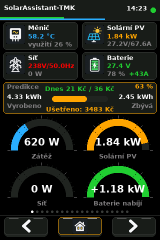 | 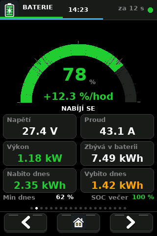 | 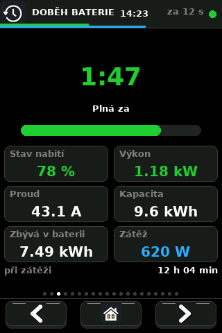 |

| Solár | Síť a zátěž | Měnič |
|---|---|---|
| 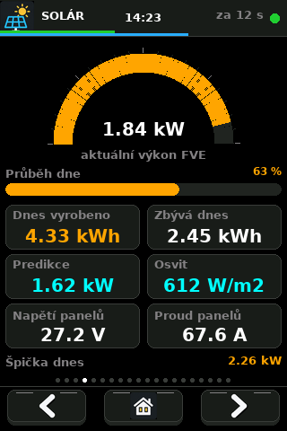 | 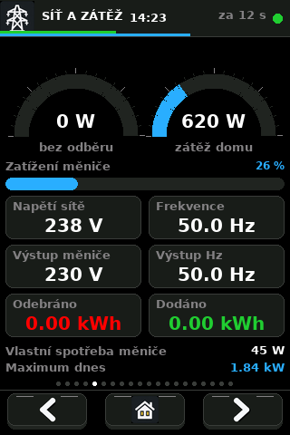 | 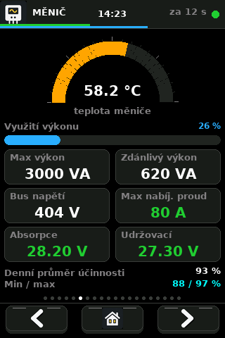 |

| Počasí | Grafy | Teploty |
|---|---|---|
| 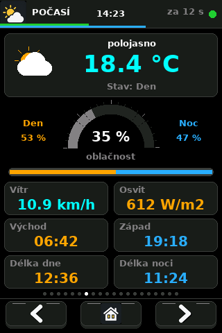 | 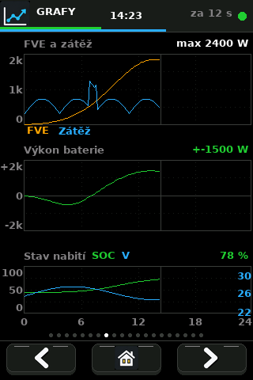 | 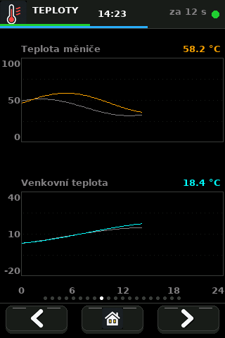 |

| Historie | Úspory | Predikce úspor |
|---|---|---|
| 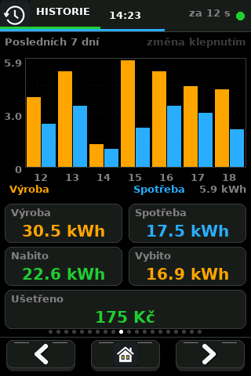 | 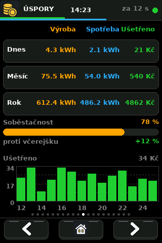 | 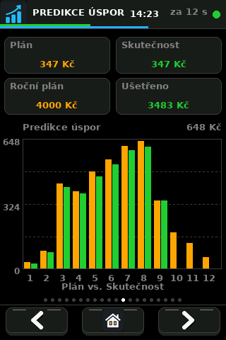 |

| Dnes a včera | Návratnost | Chyby a výpadky |
|---|---|---|
| 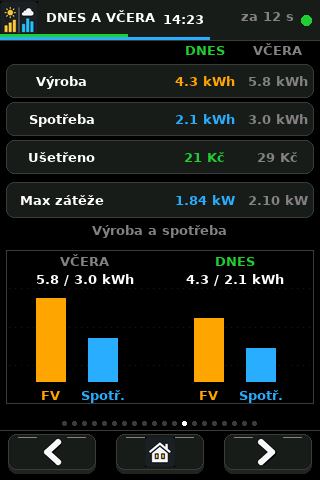 | 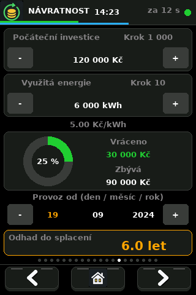 | 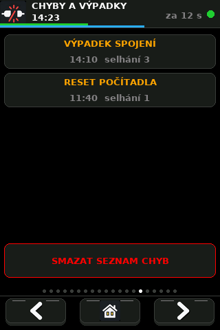 |

| Upozornění | Nastavení | Nastavení 2 |
|---|---|---|
| 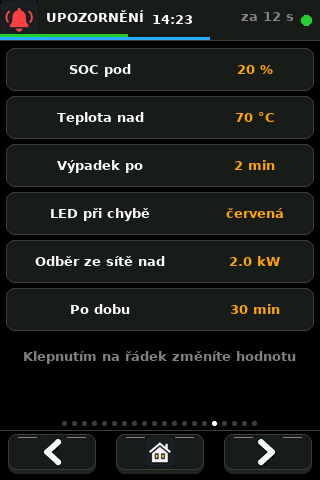 | 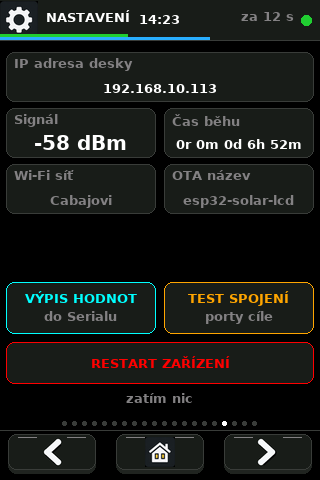 | 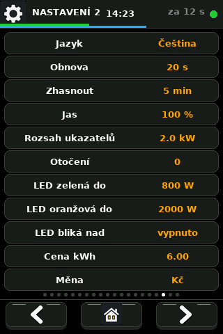 |

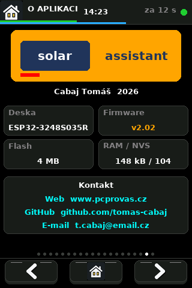

[Všech 20 obrazovek na jednom listu](images/vsechny-obrazovky.png)

### Počasí a vzhled

Počasí rozlišuje ikonami den/noc, oblačnost, mlhu, srážky a bouřky. Oranžovo-modrý
pruh pod oblačností ukazuje podíl délky dne a noci; procenta a odpovídající
délky jsou ve stejných barvách. Všechny stránky používají společný styl karet.

[Přehled ikon počasí ve dne a v noci](images/weather-icons.png)

[Přehled bitmapových ikon rozhraní](images/ui-icons-38.png)

### Ovládání návratnosti

Stránka Návratnost je nezávislá na API. Investici a využitou
energii upravíte tlačítky − / +. Klepnutím na horní část bloku měníte krok
1 / 10 / 100 / 1 000 / 10 000; u energie je krok vždy v kWh, i při zobrazení MWh.
Klepnutím na datum jej aktivujete. Vyberte den, měsíc nebo rok a upravte jej
tlačítky − / +. Zadejte datum, od kterého byla uvedená energie nasbírána.

Vrácená částka = energie × aktuální cena z Nastavení. Změna ceny přepočítá
celou návratnost. Odhad zbývajících let vychází z průměru od zadaného data;
nezohledňuje sezónnost ani budoucí změny cen. Bez platného času, kladné
investice a energie nebo při dnešním/budoucím počátku se odhad nezobrazí.
Hodnoty přežijí restart; při neúspěšném uložení se zobrazí chyba a změna se vrátí.

---

## Obsah

- [Co to umí](#co-to-umí)
- [Hardware](#hardware)
- [Pinout desky](#pinout-desky)
- [Knihovny](#knihovny)
- [Nastavení Arduino IDE](#nastavení-arduino-ide)
- [Konfigurace TFT_eSPI](#konfigurace-tft_espi)
- [Konfigurace firmwaru](#konfigurace-firmwaru)
- [Obrazovky](#obrazovky)
- [Nastavení za běhu](#nastavení-za-běhu)
- [Jazyky a font](#jazyky-a-font)
- [OTA](#ota)
- [Struktura projektu](#struktura-projektu)
- [Řešení problémů](#řešení-problémů)

---

## Co to umí

- **20 obrazovek** – přehled, baterie, životnost baterií, solár, síť a zátěž, počasí, měnič,
  výkonové a teplotní grafy, historie, úspory, predikce, nastavení a chyby
- **Denní graf 0–24 h** – špička každého desetiminutového úseku podle reálného
  času z NTP; průměr by krátké odběry schoval
- **Signalizace zátěže RGB diodou** na desce – zelená / oranžová / červená
- **4 jazyky rozhraní** – čeština, angličtina, polština, němčina
- **Detekce starých dat** – při výpadku spojení displej nepředstírá, že je vše
  v pořádku
- **Úsporný režim** – po nečinnosti zhasne podsvícení, probudí se dotykem
- **OTA** – aktualizace firmwaru přes Wi-Fi bez kabelu
- **Síťová diagnostika** přímo v zařízení – test portů i sken celé podsítě
- **Historie přežije restart** – ukládá se do NVS, po výpadku se navazuje
- **Graf historie za 7 dní, 31 dní nebo 12 měsíců** – přepíná se klepnutím
  na graf
- **Soběstačnost** – jakou část spotřeby pokryl vlastní zdroj
- **Porovnání s předchozím dnem** – o kolik procent se dnes ušetřilo víc
  nebo míň
- **Denní extrémy** – špička FVE, minimum SOC, maximum zátěže
- **Upozornění** – nízký stav baterie nebo přehřívající se měnič
- **Automatický restart** po dlouhodobém výpadku spojení

---

## Hardware

### Deska

**ESP32-3248S035R**, někdy prodávaná jako „Cheap Yellow Display 3.5" nebo
„ESP32 Yellow".

| | |
|---|---|
| MCU | ESP32-D0WD-V3, 2 jádra, 240 MHz |
| Flash | 4 MB |
| PSRAM | není |
| Displej | 3,5", řadič **ST7796**, 480×320 px, SPI |
| Dotyk | **XPT2046**, rezistivní, **sdílí SPI s displejem** |
| Podsvícení | GPIO27, řízené PWM |
| RGB LED | GPIO 4 / 16 / 17, aktivní v LOW |
| Napájení | USB-C nebo micro-USB, 5 V |

> **Pozor na záměnu.** Většina návodů na internetu popisuje **2,8" variantu
> ESP32-2432S028R**, která má jiný řadič (ILI9341), podsvícení na GPIO21
> a dotyk na vlastní SPI sběrnici. Na tuto desku ty návody **nesedí**.

### Jak poznat, že máte správnou desku

| Vlastnost | 2,8" (2432S028R) | **tato deska (3248S035R)** |
|---|---|---|
| Úhlopříčka | 2,8" | **3,5"** |
| Řadič | ILI9341 | **ST7796** |
| Rozlišení | 320×240 | **480×320** |
| Podsvícení | GPIO21 | **GPIO27** |
| Dotyk | vlastní SPI (25/32/33/39) | **sdílená SPI, CS 33** |

---

## Pinout desky

### Displej (HSPI)

| Funkce | GPIO |
|---|---|
| MISO | 12 |
| MOSI | 13 |
| SCLK | 14 |
| CS | 15 |
| DC | 2 |
| RST | – (natvrdo na EN) |
| Podsvícení | **27** |

### Dotyk XPT2046

Sdílí SPI sběrnici s displejem, vlastní má jen CS.

| Funkce | GPIO |
|---|---|
| CS | **33** |
| IRQ | 36 (firmware ho nepoužívá) |

### Ostatní

| Periferie | GPIO |
|---|---|
| RGB LED – R / G / B | 4 / 16 / 17 (aktivní v LOW) |
| SD karta – CS / MOSI / MISO / SCK | 5 / 23 / 19 / 18 |
| Reproduktor | 26 |

### Omezení GPIO na ESP32

- GPIO **34, 35, 36, 39** jsou pouze vstupní, bez pull-up/pull-down
- GPIO **12** je strapping pin (MTDI), při bootu nesmí být tažený do HIGH
- ADC2 (GPIO 4, 12–15, 25–27) **nelze číst při zapnuté Wi-Fi** – pro analogové
  vstupy použijte ADC1 (GPIO 32–39)

---

## Knihovny

Nainstalujte přes **Tools → Manage Libraries**:

| Knihovna | Autor | Verze |
|---|---|---|
| **TFT_eSPI** | Bodmer | 2.5.x a novější |
| **ArduinoJson** | Benoit Blanchon | 6.x nebo 7.x |

Ostatní (`WiFi`, `HTTPClient`, `ArduinoOTA`, `Preferences`, `time.h`) jsou
součástí jádra ESP32, nic se neinstaluje.

Skeč si sám poradí s rozdíly mezi verzemi:

- **ArduinoJson 6 vs 7** – v sedmičce byl odstraněn `DynamicJsonDocument`,
  přepíná se přes `ARDUINOJSON_VERSION_MAJOR`
- **ESP32 core 2.x vs 3.x** – trojka změnila LEDC API (`ledcSetup` +
  `ledcAttachPin` → `ledcAttach`), řeší `ESP_ARDUINO_VERSION_MAJOR`

---

## Nastavení Arduino IDE

### Podpora ESP32

*File → Preferences → Additional boards manager URLs*:

```
https://espressif.github.io/arduino-esp32/package_esp32_index.json
```

Pak *Tools → Board → Boards Manager* → nainstalovat **esp32** (Espressif
Systems), verze 2.0.x nebo 3.x.

### Volby v menu Tools

| Položka | Hodnota |
|---|---|
| Board | **ESP32 Dev Module** |
| Upload Speed | 921600 |
| Flash Size | 4MB (32Mb) |
| **Partition Scheme** | **Minimal SPIFFS (1.9MB APP with OTA/190KB SPIFFS)** |
| PSRAM | Disabled |

> Pro OTA musí být zvoleno schéma **Minimal SPIFFS**. Má dvě aplikační oblasti
> po 1,9 MB; jedna běží a druhá slouží pro novou verzi firmwaru.

---

## Konfigurace TFT_eSPI

TFT_eSPI se nastavuje **editací souboru uvnitř knihovny**, ne ve skeči.
Obsah `User_Setup_CYD.h` z tohoto projektu zkopírujte přes:

```
<sketchbook>\libraries\TFT_eSPI\User_Setup.h
```

Cestu ke sketchbooku najdete v *File → Preferences → Sketchbook location*.

Nutné minimum:

```c
#define ST7796_DRIVER
#define TFT_WIDTH  320
#define TFT_HEIGHT 480
#define USE_HSPI_PORT     // bez toho jede displej na VSPI a nekreslí
#define TFT_MISO 12
#define TFT_MOSI 13
#define TFT_SCLK 14
#define TFT_CS   15
#define TFT_DC    2
#define TFT_RST  -1
#define TFT_BL   27
#define TFT_BACKLIGHT_ON HIGH
#define TOUCH_CS 33       // dotyk sdílí sběrnici s displejem
```

> **Po každé aktualizaci knihovny se `User_Setup.h` přepíše** a je nutné
> kopírování zopakovat. Skeč proto obsahuje kontrolu – když je v knihovně
> starý soubor, překlad selže s vysvětlením místo toho, aby zůstal černý
> displej.

Arduino IDE navíc občas cachuje přeložené knihovny. Po změně `User_Setup.h`
zavřete a znovu otevřete IDE.

---

## Konfigurace firmwaru

Před prvním překladem zkopírujte `secrets.example.h` jako `secrets.h` a
doplňte vlastní údaje. `secrets.h` je v `.gitignore` a nesmí se publikovat.

```c
// secrets.h — Wi-Fi
const char* ssid     = "vaše_síť";
const char* password = "vaše_heslo";

// Solar Assistant
#define API_HOST "192.168.10.240"
const char* url  = "http://" API_HOST "/api/v1/metrics";
const char* user = "admin";
const char* pass = "vaše_heslo";

// OTA
#define OTA_HOST     "esp32-solar-lcd"
#define OTA_PASSWORD "vaše_heslo"

// Časové pásmo (včetně letního času)
#define NTP_TZ "CET-1CEST,M3.5.0,M10.5.0/3"
```

### Používané hodnoty z API

Solar Assistant vrací přes 100 topiců, firmware jich používá 40. Mapování je
v tabulce `METRICS[]` – přidání nebo odebrání je jeden řádek.

Několik rozhodnutí, která nejsou z kódu zřejmá:

| Údaj | Zdroj | Proč |
|---|---|---|
| Dnes vyrobeno | `weather/pv_energy_generated` | `total/pv_energy` měří delší období |
| Zbývá dnes | `weather/pv_energy_remaining_today` | |
| Max výkon měniče | `inverter_1/max_ac_output_apparent_power` | zdánlivý výkon ve VA |

**Znaménka:** kladný `battery_power` = nabíjení, kladný `grid_power` = odběr
ze sítě.

Kompletní výpis všech dostupných proměnných si vyžádáte tlačítkem
**VÝPIS HODNOT** na stránce NASTAVENÍ – vypíše se do Serial monitoru
(115200 Bd) i s jednotkami.

---

## Obrazovky

Přepínají se tlačítky dole: **◀ | domů | ▶**. Tečky nad nimi ukazují pozici.

| # | Obrazovka | Obsah |
|---|---|---|
| 0 | **Solar Assistant** | 4 karty s ikonami, blok Predikce s posuvníkem, 4 ukazatele |
| 1 | **Baterie** | Velký prstenec SOC, %/hod, napětí, proud, výkon, kapacita |
| 2 | **Solár** | Výkon FVE, průběh dne, predikce, osvit, napětí a proud panelů |
| 3 | **Síť a zátěž** | Odběr, zátěž, zatížení měniče, napětí, frekvence, energie |
| 4 | **Počasí** | Oblačnost, teplota, vítr, osvit, predikce výroby |
| 5 | **Měnič** | Teplota, využití výkonu, nabíjecí napětí, bus napětí |
| 6 | **Grafy** | Dnešní den 0–24 h: FVE a zátěž, výkon baterie, SOC |
| 7 | **Grafy** | Dnešní den 0–24 h: FVE a zátěž, výkon baterie, SOC |
| 8 | **Teploty** | Dnešní graf teploty měniče a venkovní teploty |
| 9 | **Historie** | Výroba, spotřeba a úspory za 7 / 31 dní nebo 12 měsíců |
| 10 | **Úspory** | Dnešní, měsíční a roční úspora, soběstačnost a denní graf |
| 11 | **Predikce úspor** | Sezónní měsíční plán úspor proti skutečnosti |
| 12 | **Nastavení** | IP, signál, čas běhu, paměť, verze + diagnostické nástroje |
| 13 | **Nastavení 2** | Jazyk a všechna uživatelská nastavení |
| 14 | **Chyby a výpadky** | Seznam chyb, výpadků a tlačítko pro smazání |
| 15 | **Upozornění** | Limity SOC, teploty, výpadku a RGB LED |
| 16 | **O aplikaci** | Informace o firmwaru a kontakt |

Na úvodní obrazovce lze **kliknout na kterýkoli blok** a proklikne na jeho
podrobnou stránku.

### Barvy ukazatelů

| Ukazatel | Barva |
|---|---|
| Zátěž | Modrá |
| Solární PV | Oranžová |
| Síť | Červená při odběru, jinak šedá |
| Baterie | Zelená při nabíjení, červená při vybíjení |

Na stránce Baterie zůstane číslo **pod 20 % červené i při nabíjení** –
varování má přednost před informací o směru toku.

### Signalizace zátěže RGB diodou

| Barva | Zátěž |
|---|---|
| Zelená | do prahu „LED zelená do" |
| Oranžová | mezi prahy |
| Červená | nad prahem „LED oranžová do" |
| Modrá | není spojení s API |

### Detekce starých dat

Když se déle než 75 s nepodaří nic načíst:

- hlavička zčervená
- místo odpočtu je stáří dat
- kolem obsahu je červený rámeček
- dioda na desce zmodrá

---

## Nastavení za běhu

Stránka **NASTAVENÍ 2**, klepnutím na řádek se hodnota posune na další.
Vše se ukládá do NVS, takže přežije restart i aktualizaci firmwaru.

| Položka | Možnosti | Výchozí |
|---|---|---|
| Jazyk | Čeština / English / Polski / Deutsch | Čeština |
| Obnova | 10 / 20 / 30 / 60 s | 20 s |
| Zhasnout | vypnuto / 1 / 5 / 15 / 30 min | 5 min |
| Jas | 25 / 50 / 75 / 100 % | 100 % |
| Rozsah ukazatelů | 1 / 2 / 3 / 5 kW | 2 kW |
| LED zelená do | 400 / 600 / 800 / 1000 W | 800 W |
| LED oranžová do | 1500 / 2000 / 2500 / 3000 W | 2000 W |
| Otočení | 0° / 180° | 0° |

> Kalibrace dotyku platí vždy jen pro jedno otočení. Po změně otočení se proto
> kalibrace spustí znovu a uloží se pod vlastním klíčem.

### Diagnostické nástroje (stránka NASTAVENÍ)

| Tlačítko | Co udělá |
|---|---|
| **VÝPIS HODNOT** | Stáhne data a vypíše všechny proměnné do Serialu |
| **TEST SPOJENÍ** | Ověří bránu a zkusí obvyklé porty na adrese měniče |
| **SKEN SÍTĚ** | Projde `.1`–`.254` a najde, kde něco poslouchá na portu 80 |

---

## Jazyky a font

Vestavěná písma TFT_eSPI obsahují jen ASCII. Projekt proto používá vlastní
**smooth font** (formát `.vlw`) vložený přímo do kódu jako pole bajtů –
DejaVu Sans Bold 14 px, 136 glyfů pokrývajících češtinu, polštinu i němčinu.

Texty jdou přes tento font, **čísla zůstala na vestavěných písmech** – číslice
diakritiku nepotřebují a sedmisegmentové písmo vypadá na velkých hodnotách líp.

TFT_eSPI umí mít načtené **jen jedno smooth písmo naráz**, proto jsou v kódu
dvě obálky, které si přepínání hlídají samy:

| Funkce | Použití |
|---|---|
| `tCz(text, x, y)` | Text s diakritikou, smooth font |
| `tAs(text, x, y, font)` | Čísla a jednotky, vestavěné písmo |

### Přegenerování fontu a překladů

```bash
pip install pillow
python mklang.py          # vyrobí Lang.h a glyphs.txt z tabulky překladů
python make_vlw.py 14 FontUi FontUi.h glyphs.txt
```

Velikost 14 px je zvolená tak, aby výška řádku (17 px) odpovídala vestavěnému
písmu 2 a rozvržení obrazovek se nerozsypalo.

> **Licence fontu.** DejaVu Sans má volnou licenci (Bitstream Vera / DejaVu),
> která použití, úpravu i další šíření povoluje. Zdrojové TTF je součástí
> projektu, plné znění v `LICENSE_DEJAVU.txt`.

---

## OTA

Po připojení k síti se deska nabízí přes mDNS jako `esp32-solar-lcd.local`.
Pokud mDNS funguje, objeví se v **Tools → Port** v Arduino IDE a lze ji nahrát
normálně tlačítkem Upload, bez kabelu. Během aktualizace se na displeji ukáže
průběh v procentech.

Pokud se síťový port neobjeví (časté při PC na Ethernetu a ESP na Wi-Fi),
spusťte v PowerShellu ze složky projektu:

```powershell
powershell -ExecutionPolicy Bypass -File .\Nahrat-OTA.ps1
```

Skript se zeptá na IP adresu a OTA heslo, zkompiluje správnou OTA variantu a
nahrání provede přímo přes IP. Nepotřebuje Bonjour ani mDNS.

**První nahrání musí proběhnout přes USB.**

Heslo se nastavuje v `OTA_PASSWORD`. Prázdné heslo znamená, že firmware může
nahrát kdokoli ve stejné síti.

---

## Struktura projektu

```
SolaAssistant-TMK/
├── SolarAssistant-TMK.ino  hlavní skeč
├── FontUi.h                smooth font jako pole bajtů (generovaný)
├── Lang.h                  překladová tabulka (generovaná)
├── UiIcons.h               bitmapové ikony RGB565 (generované)
├── User_Setup_CYD.h        konfigurace TFT_eSPI – kopíruje se do knihovny
├── DejaVuSans-Bold.ttf     zdrojové písmo pro generátor
├── make_vlw.py             generátor fontu
├── make_ui_icons.py        generátor ikon z dodané sady 4×4
├── assets/                 původní zdrojová sada ikon
├── render.py               vykreslovač náhledů obrazovek
├── screens.py              definice náhledů s ukázkovými daty
├── images/                 náhledy obrazovek (generované)
├── mklang.py               generátor překladů
├── glyphs.txt              sada znaků pro font (generovaná)
├── check_fit.py            kontrola, zda se popisky vejdou ve všech jazycích
├── check_glyphs.py         kontrola, zda má každý znak glyf ve fontu
├── check_braces.py         kontrola struktury skeče
├── FEATURES.md             seznam obrazovek a funkcí (CZ/EN)
├── LICENSE                 MIT
├── LICENSE_DEJAVU.txt      licence použitého písma
├── README.md               tento soubor
├── README.en.md            anglická verze
└── README.de.md            německá verze
```

`FontUi.h`, `Lang.h` i `glyphs.txt` musí ležet ve stejné složce jako skeč.

---

## Licence

Kód je pod **MIT** (viz `LICENSE`). Přibalené písmo DejaVu Sans má vlastní
volnou licenci, viz `LICENSE_DEJAVU.txt`.

---

## Řešení problémů

| Projev | Příčina / oprava |
|---|---|
| Překlad selže na `#error` | V knihovně je starý `User_Setup.h` – zkopírovat znovu |
| `text section exceeds available space` | Ověřit desku ESP32 Dev Module a aktuální knihovny |
| Bílá obrazovka, podsvícení svítí | Špatný ovladač – ověřit `ST7796_DRIVER` |
| Obrazovka zůstává tmavá | `TFT_BL` musí být 27 |
| Kresba se nezobrazuje vůbec | Chybí `USE_HSPI_PORT` – displej by jel na VSPI |
| Obraz vzhůru nohama | Nastavení 2 → Otočení, nebo `iRot` |
| Červená a modrá prohozené | `TFT_RGB_ORDER` přepnout `TFT_BGR` ↔ `TFT_RGB` |
| Dotyk nereaguje | Chybí `#define TOUCH_CS 33` |
| Dotyk je posunutý | Držet prst na displeji při zapnutí → spustí se kalibrace |
| `HTTP chyba: -1` | Nelze navázat TCP spojení – použít TEST SPOJENÍ a SKEN SÍTĚ |
| `HTTP chyba: 401` | Špatné jméno nebo heslo k API |
| `JSON chyba: NoMemory` | Zvětšit `DynamicJsonDocument(24576)` (jen ArduinoJson 6) |
| Graf je prázdný, hlásí čekání na čas | Deska nemá přístup na NTP – ověřit bránu a DNS |
| Změna v `User_Setup.h` se neprojeví | Arduino IDE cachuje – zavřít a znovu otevřít |
| Místo háčků divné znaky | Skeč musí být uložený v UTF-8 |

### Když se nestahují data

1. **TEST SPOJENÍ** – pokud neodpovídá ani brána, je deska na síti s izolací
   klientů (hostovská Wi-Fi nebo jiná VLAN) a na LAN se nedostane vůbec
2. **SKEN SÍTĚ** – najde, na jaké adrese něco poslouchá; Solar Assistant mohl
   dostat z DHCP jinou IP
3. Ověřte z počítače:
   ```bash
   curl -v -u admin:heslo http://192.168.10.240/api/v1/metrics
   ```

Měniči na routeru doporučuji nastavit **pevnou rezervaci IP**, ať se to
neopakuje.
